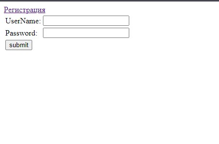
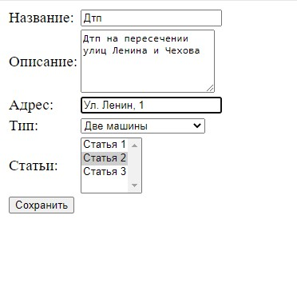
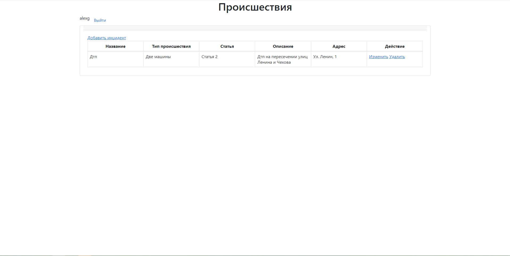

# job4j_car_accident

"Автонарушители" - вэб-приложение для добавления автонарушений и просмотра списка всех добавленных нарушений.
Технологии: 
-Spring: Core, MVC, DATA, Security
-Hibernate
-PostgreSQL
-Maven
-Tomcat
-JSP
-JSTL
В приложении присутствует регистрация и аутентификация пользователя.
 

 

 

 
<h2>
  Сборка проекта:
  </h2>
  mvn install
   
Сборка проекта с помощью Maven в WAR-архив для последующего развертывания в контейнере сервлетов (Apache Tomcat).

